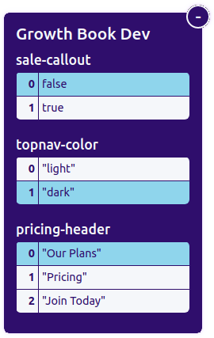

# Growth Book React Library

Small utility library to run controlled experiments (i.e. A/B/n tests) in React.


-  No external dependencies
-  Lightweight and fast (4Kb gzipped)
-  No HTTP requests, everything is defined and evaluated locally
-  Works for both client and server-side rendering
-  Written in Typescript with an extensive test suite
-  Advanced user and page targeting
-  Use your existing event tracking (Segment, Snowplow, Mixpanel, custom)
-  Adjust variation weights and targeting without deploying new code

## Installation

`yarn add @growthbook/growthbook-react` 

or 

`npm install --save @growthbook/growthbook-react`

## Quick Usage

Step 1: Wrap your app in a GrowthBookProvider
```ts
import {GrowthBookClient, GrowthBookProvider} from '@growthbook/growthbook-react';

// Instantiate a client
const client = new GrowthBookClient();

export default function App() {
  // Get the user id from your auth system
  const {userId} = useAuth();
  
  // Store a GrowthBookUser object in state
  const [growthBookUser, setGrowthBookUser] = useState(null);
  useEffect(() => {
    setGrowthBookUser(userId ? client.user({id: userId}) : null);
  }, [userId])

  // Wrap your app in a GrowthBookProvider component
  return (
    <GrowthBookProvider user={user} dev={true}>
      <OtherComponent/>
    </GrowthBookProvider>
  )
}
```

Step 2: Run experiments!

```ts
import {useExperiment} from '@growthbook/growthbook-react';

export default function OtherComponent() {
  const {value} = useExperiment({
    key: "headline-test",
    variations: ["Hello World", "Hola Mundo"]
  });

  return <h1>{value}</h1>
}
```

## Dev Mode

When you pass `dev={true}` to the GrowthBookProvider, it enables development mode.  This adds a variation switcher UI that floats on the bottom left of pages.  Use this to easily test out all the experiment combinations.



## Experiments

The simplest experiment you can define has just 2 fields: `key` and `variations`.

There are a lot more configuration options you can specify.  Here is the full typescript definition:

```ts
interface Experiment {
    // The globally unique tracking key for the experiment
    key: string;
    // Array of variations
    variations: any[];
    // How to weight traffic between variations. Array of floats that add to 1.
    weights?: number[];
    // "running" is always active
    // "draft" is only active during QA
    // "stopped" is only active when forcing a winning variation
    status?: "draft" | "running" | "stopped";
    // What percent of users should be included in the experiment. Float from 0 to 1.
    coverage?: number;
    // Users can only be included in this experiment if the current URL matches this regex
    url?: string;
    // Array of strings if the format "{key} {operator} {value}"
    // Users must pass all of these targeting rules to be included in this experiment
    targeting?: string[];
    // All users included in the experiment will be forced into the 
    // specified variation index
    force?: number;
    // If true, use anonymous id for assigning, otherwise use logged-in user id
    anon?: boolean;
}
```

## Running Experiments

The useExperiment hook returns an object with a few useful properties

```ts
const {inExperiment, index, value} = useExperiment({
    key: "my-experiment",
    variations: ["A", "B"]
});

// If user is part of the experiment
console.log(inExperiment); // true or false

// The index of the assigned variation
console.log(index); // 0 or 1

// The value of the assigned variation
console.log(value); // "A" or "B"
```

The `inExperiment` flag can be false if the experiment defines any sort of targeting rules which the user does not pass.  In this case, the user is always assigned index `0`.

## Client Configuration

The GrowthBookClient constructor takes an optional `options` argument.

Below are all of the available options:

-  **enabled** - Default true. Set to false to completely disable all experiments.
-  **debug** - Default false. If set to true, console.log info about why experiments are run and why specific variations are chosen.
-  **onExperimentViewed** - Callback when the user views an experiment. Passed an object with `experiment` and `variation` properties.
-  **url** - The URL for the current request (defaults to `window.location.href` when in a browser)
-  **enableQueryStringOverride** - Default true.  If true, enables forcing variations via the URL.  Very useful for QA.  https://example.com/?my-experiment=1

### SPA support

With a Single Page App (SPA), you need to update the client on navigation in order to target tests based on URL:

```ts
client.setUrl(newUrl);
```

Doing this with Next.js for example, will look like this:
```tsx
export default function MyApp({ Component, pageProps }) {
  const router = useRouter()

  useEffect(() => {
    const onChange = (newUrl) => client.setUrl(newUrl);
    router.events.on('routeChangeComplete', onChange);
    return () => router.events.off('routeChangeComplete', onChange);
  }, [])

  return <Component {...pageProps} />
}
```

## User Configuration

The `client.user` method supports both logged-in and anonymous users. To create an anonymous user, specify `anonId` instead of `id`:
```js
const user = client.user({anonId: "abcdef"});
```

If you have both an anonymous id and a logged-in user id, you can pass both:
```js
const user = client.user({
    anonId: "abcdef",
    userId: "12345"
});
```

You can also include attributes about the user.  These attributes are never sent across the network and are only used to locally evaluate experiment targeting rules:

```js
const user = client.user({
    id: "12345",
    attributes: {
        // Any attributes about the user or page that you want to use for experiment targeting
        premium: true,
        accountAge: 36,
        source: "google"
    }
});
```

You can update these at any time by calling `user.setAttributes`. By default, this completely overwrites all previous attributes. To do a 
shallow merge instead, pass `true` as the 2nd argument.

```js
user.setAttributes({
    premium: false
})
```

### Targeting

Experiments can target on these user attributes with the `targeting` field.  Here's an example:

```ts
const {inExperiment, value} = useExperiment({
    key: "my-targeted-experiment",
    variations: ["A", "B"],
    targeting: [
        "premium = true",
        "accountAge > 30"
    ]
})
```

If the user does not match the targeting rules, `inExperiment` will be false and they will be assigned variation index `0`.

## Overriding Weights and Targeting

It's common practice to adjust experiment settings after a test is live.  For example, slowly ramping up traffic, stopping a test automatically if guardrail metrics go down, or rolling out a winning variation to 100% of users.

Instead of constantly changing your code, you can use client overrides.  For example, to roll out a winning variation to 100% of users:
```ts
client.overrides.set("experiment-key", {
    status: 'stopped',
    // Force variation index 1
    force: 1
});
```

The full list of experiment properties you can override is:
*  status
*  force
*  weights
*  coverage
*  targeting
*  url

This data structure can be easily seralized and stored in a database or returned from an API.  There is a small helper function if you have all of your overrides in a single JSON object:

```ts
client.importOverrides({
    "key1": {...},
    "key2": {...},
    ...
})
```

## Tracking Metrics and Analyzing Results

This library only handles assigning variations to users.  The 2 other parts required for an A/B testing platform are Tracking and Analysis.

### Tracking Metrics

We recommend using your existing event tracking system, whether it is Google Analytics, Mixpanel, Segment, or something custom that you've built.

In addition to tracking metrics, you'll want to track when a user views an experiment:

```ts
// Specify a tracking callback when instantiating the client
const client = new GrowthBookClient({
    onExperimentViewed: (data) => {
        // Example using Segment
        analytics.track("Experiment Viewed", {
            experimentId: data.experiment.key,
            variationId: data.index
        });
    }
});
```

The data object passed to your callback has the following properties:
-  experiment
-  value (the assigned variation)
-  index (the array index of the assigned variation)
-  userId
-  anonId
-  userAttributes

### Analysis

For analysis, there are a few options:

*  Online A/B testing calculators
*  Built-in A/B test analysis in Mixpanel/Amplitude
*  Python or R libraries and a Jupyter Notebook
*  The [Growth Book App](https://www.growthbook.io) (more info below)

### The Growth Book App

Managing experiments and analyzing results at scale can be complicated, which is why we built the [Growth Book App](https://www.growthbook.io).  It's completely optional, but definitely worth checking out.

-  Document your experiments with screenshots, markdown, and comment threads
-  Connect to your existing data warehouse or analytics tool to automatically fetch results
   -  Currently supports Snowflake, BigQuery, Redshift, Postgres, Mixpanel, GA, and Athena
-  Advanced bayesian statistics and automated data-quality checks (SRM, etc.)
-  Simple and affordable pricing

Integration is super easy:

1.  Create a Growth Book API key - https://docs.growthbook.io/api
2.  Periodically fetch the latest experiment overrides from the API and cache in Redis, Mongo, etc.
3.  At the start of your app, run `client.importOverrides(listFromCache)`

Now you can start/stop tests, adjust coverage and variation weights, and apply a winning variation to 100% of traffic, all within the Growth Book App without deploying code changes to your site.
